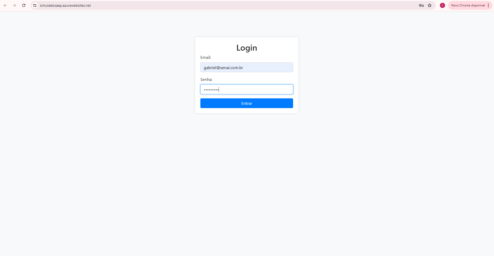
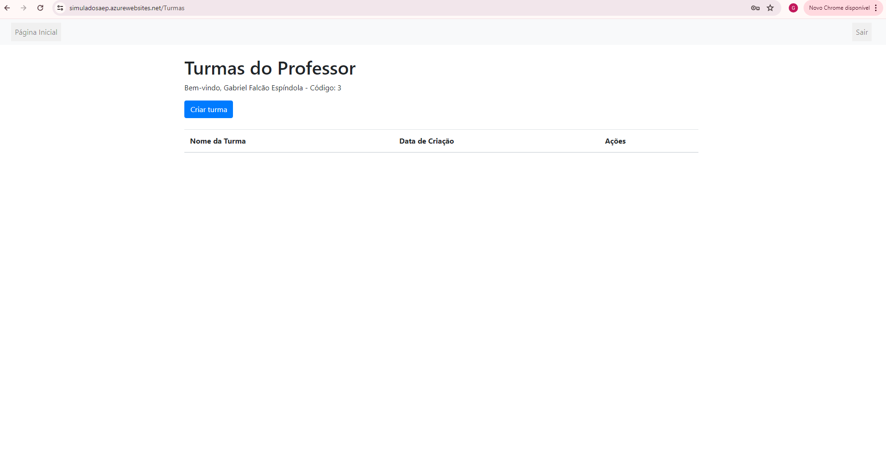
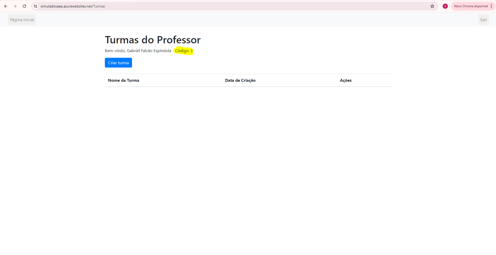
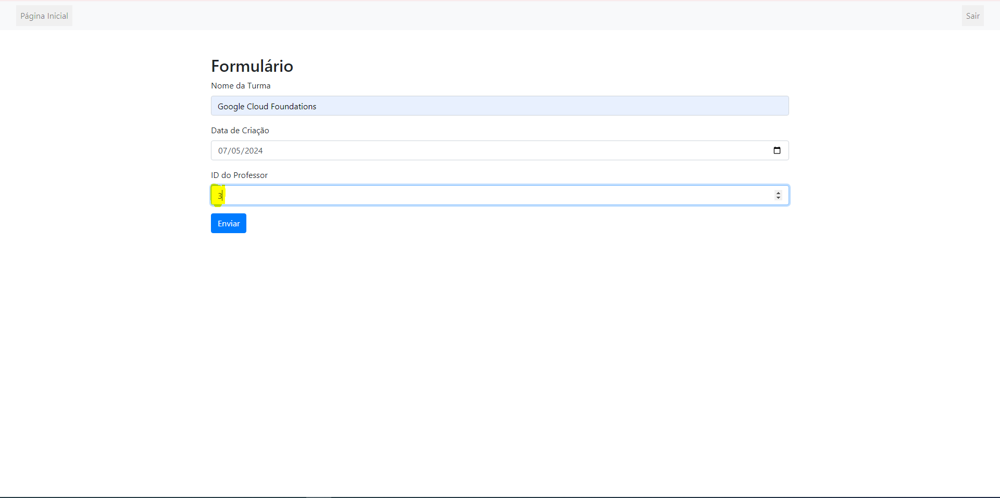
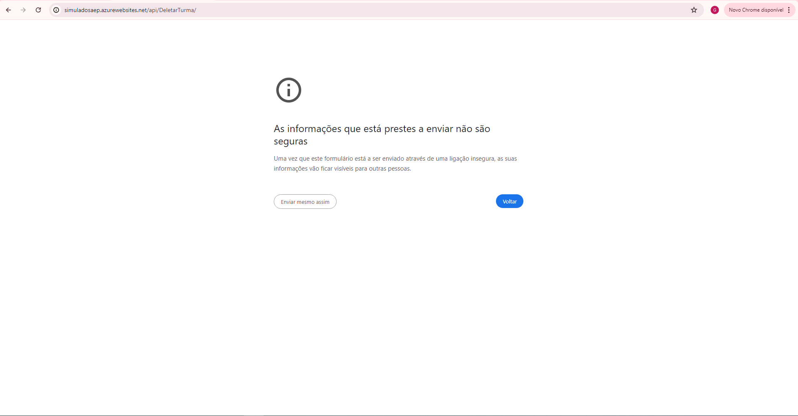

"# SimuladoSAEP" 

##BASE DE DADOS 
A base de dados possui 1 database e 4 tabelas (usuarios, professores, turmas e atividades) utilizando o MySQL versão 8.0.36.
A base de dados do projeto está armazenada na nuvem do azure. É possível acessa-la remotamente através do MySQL Workbench ou alguma outra ferramenta SGBD comparível ao mysql. 
Para acessar o banco de dados basta inserir os seguintes dados:
Host: server-saep.mysql.database.azure.com
User: gabriel 
Password: senai114@
Port: 3306

Obs: certificação SSL está desabilitado. 

##Projeto 
O projeto foi desenvolvido como um simulado da prova prática SAEP, onde o exercício proposta foi elaborar um sistema de cadastro de turmas e atividades para professores de uma escola. 
Até o momento o projeto possui 3 usuários, sendo eles: 

2. Email: gabriel@teste.com.br - Senha: senha1234 
3. Email: marcus@teste.com.br - Senha: senha0000
4. Email: gabriel@senai.com.br - Senha: senha1234

Funcionamento:
1. Na página index podemos colocar qualquer um dos 3 usuários citados acima  

2. E em seguida seremos redirecionados para a página de turmas, onde será possível visualizar todas as turmas vinculadas aquele usuário em específico que foi feito o login. 

3. Nessa página temos algumas opções, como "Criar turma", "Exluir turma", "Visualizar" e "sair". 
   1. O botão de Criar turma irá te redirecionar para um formulário onde será criado uma nova turma assim que for feito o envio 
   2. O botão exluir turma irá deleta-la assim que for confirmado 
   3. O botão visualizar irá te redirecionar para uma outra página onde será listada as atividades daquela turma 
   4. O botão sair irá fazer o logout do sistema 

4. ATENÇÃO! Na hora de fazer o cadastro de uma turma, é necessário visualizar antes o código do professor, para inserir ele no formulário. Conforme imagens abaixo: 
   
   

5. ATENÇÃO2! Os botões de excluir (inclusive "Excluir Turma" ou "Excluir Atividade") estão dando erro nos navegadores por questão de segurança do próprio navegador, isso se deve pelo fato do programa ser desenvolvido com http ao invés de https e não possui nenhum certificado ssl. Ainda não foi encontrado nenhuma alternativa para desabilitar essa opção dentro do navegador, mas caso queira testar a função de excluir, é possível fazer um clone do repositório localmente e então funcionará corretamente a função de excluir.

